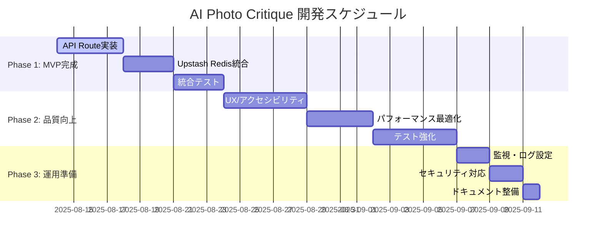

# 開発ロードマップ - AI Photo Critique

## 全体スケジュール

## Phase 1: MVP完成 (2025-08-14 ～ 2025-08-24)

### 目標

完全に動作するAI写真講評アプリケーションのリリース

### Step 1: APIインフラ構築 (4日)

#### 1.1 Upstash Redis設定 ✅

- [x] KVクライアント実装 (`src/lib/kv.ts`)
- [x] 開発時フォールバック実装 (インメモリストレージ)
- [x] TTL設定 (24時間自動削除)
- [x] データスキーマ定義 (CritiqueData, ShareData)
- [x] **完了 (2025-08-18)**: 実際のUpstashインスタンス作成・接続

#### 1.2 `/api/upload` Node Function実装 ✅

- [x] ファイル処理ロジック移行
- [x] Sharp による画像リサイズ (1024px)
- [x] EXIF データ抽出
- [x] Upstash Redis への一時保存
- [x] エラーハンドリング
- [x] **完了 (2025-08-19)**: Node Runtime対応（Sharp制約のため）

#### 1.3 `/api/critique` Node Function実装

- [ ] Server Action から API Route に移行
- [ ] Gemini Vision API 呼び出し
- [ ] レスポンス形式統一
- [ ] リトライ機能実装

### Step 2: データフロー統合 (3日)

#### 2.1 Server Actions修正

- [ ] `uploadImage()` を API Route 呼び出しに変更
- [ ] `generateCritique()` を API Route 呼び出しに変更
- [ ] エラーハンドリングの統一
- [ ] レスポンス形式の調整

#### 2.2 永続化層統合

- [ ] アップロード結果のKV保存
- [ ] 講評結果のKV更新
- [ ] 短縮URL生成機能
- [ ] データ取得API実装

### Step 3: 共有機能完成 (3日)

#### 3.1 `/api/ogp` Edge Function実装

- [ ] Satori + Resvg セットアップ
- [ ] 動的OGP画像生成
- [ ] 講評内容の画像化
- [ ] フォント・レイアウト調整

#### 3.2 共有ページ改善

- [ ] `/s/[id]` ページの完全実装
- [ ] メタデータ動的生成
- [ ] OGP画像表示確認
- [ ] ソーシャル共有テスト

### Step 4: MVP検証 (1日)

- [ ] 全機能の統合テスト
- [ ] パフォーマンス測定
- [ ] エラーケース確認
- [ ] プロダクション環境デプロイ

## Phase 2: 品質向上 (2025-08-25 ～ 2025-09-08)

### Step 5: UX/アクセシビリティ (5日)

#### 5.1 アクセシビリティ対応

- [ ] WCAG AA準拠チェック
- [ ] キーボードナビゲーション
- [ ] スクリーンリーダー対応
- [ ] 色コントラスト改善
- [ ] aria-label 追加

#### 5.2 レスポンシブデザイン強化

- [ ] モバイルUI最適化
- [ ] タッチ操作改善
- [ ] 横向き表示対応
- [ ] ダークモード実装

#### 5.3 ユーザビリティ改善

- [ ] ローディング状態の改善
- [ ] プログレスバー追加
- [ ] エラーメッセージ改善
- [ ] ツールチップ追加

### Step 6: パフォーマンス最適化 (4日)

#### 6.1 画像最適化

- [ ] Next.js Image コンポーネント活用
- [ ] 遅延読み込み実装
- [ ] WebP 形式対応
- [ ] 画像圧縮最適化

#### 6.2 API パフォーマンス

- [ ] レスポンス時間測定
- [ ] キャッシュ戦略実装
- [ ] 並列処理最適化
- [ ] タイムアウト設定

#### 6.3 フロントエンド最適化

- [ ] バンドルサイズ分析
- [ ] Code Splitting実装
- [ ] Tree Shaking確認
- [ ] Core Web Vitals改善

### Step 7: テスト強化 (5日)

#### 7.1 単体テスト拡充

- [ ] API Route のテスト
- [ ] KV 操作のテスト
- [ ] エラーケースのテスト
- [ ] Edge Function のテスト

#### 7.2 E2Eテスト拡充

- [ ] 完全フローテスト
- [ ] クロスブラウザテスト
- [ ] モバイルテスト
- [ ] パフォーマンステスト

#### 7.3 テスト自動化

- [ ] CI/CD パイプライン設定
- [ ] プルリクエスト時の自動テスト
- [ ] デプロイ前チェック
- [ ] テストカバレッジ監視

## Phase 3: 運用準備 (2025-09-09 ～ 2025-09-14)

### Step 8: 監視・ログ設定 (2日)

#### 8.1 エラー監視

- [ ] Sentry 統合
- [ ] エラーアラート設定
- [ ] ログ集約設定
- [ ] パフォーマンス監視

#### 8.2 使用量監視

- [ ] Vercel Analytics 設定
- [ ] API 使用量監視
- [ ] コスト監視設定
- [ ] アラート設定

### Step 9: セキュリティ対応 (2日)

#### 9.1 セキュリティヘッダー

- [ ] CSP (Content Security Policy) 設定
- [ ] CORS 設定
- [ ] レート制限実装
- [ ] セキュリティ監査

#### 9.2 プライバシー対応

- [ ] プライバシーポリシー作成
- [ ] データ削除機能確認
- [ ] Cookie ポリシー
- [ ] GDPR 準拠確認

### Step 10: ドキュメント整備 (1日)

- [ ] API 仕様書作成
- [ ] 運用マニュアル作成
- [ ] ユーザーガイド作成
- [ ] 開発者向けドキュメント更新

## マイルストーン

### MVP リリース (2025-08-24)

- 完全な画像アップロード→講評→共有フロー
- P95 < 3秒のレスポンス時間
- 基本的なエラーハンドリング

### ベータリリース (2025-09-08)

- WCAG AA準拠
- テストカバレッジ80%以上
- パフォーマンス最適化完了

### プロダクションリリース (2025-09-14)

- 完全な監視体制
- セキュリティ対応完了
- ドキュメント整備完了

## 成功メトリクス

### 技術メトリクス

- **パフォーマンス**: P95 < 3秒
- **可用性**: 99.5%以上
- **テストカバレッジ**: 80%以上
- **Core Web Vitals**: 全て合格

### ビジネスメトリクス

- **月間運用コスト**: $50以下
- **エラー率**: 1%以下
- **ユーザビリティスコア**: 80%以上

## リスク管理

### 高リスク項目

1. **Gemini API 制限** → 使用量監視、フォールバック実装
2. **パフォーマンス未達** → 段階的最適化、プロファイリング
3. **セキュリティ脆弱性** → 定期監査、セキュリティテスト

### 緊急時対応

- **API 障害**: フォールバック機能、ユーザー通知
- **パフォーマンス劣化**: 自動スケーリング、キャッシュ強化
- **セキュリティ問題**: 即座の機能停止、パッチ適用

---

**作成日**: 2025-08-14  
**最終更新**: 2025-08-14  
**次回レビュー予定**: 2025-08-21 (Phase 1完了時)
