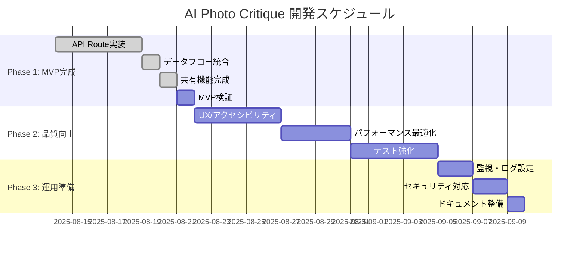

# 開発ステータス & ロードマップ - AI Photo Critique

## 📊 全体進捗状況

**現在位置**: Phase 1 Step 3 完了（共有機能完成） → Step 4 MVP検証開始



---

## 🎯 Phase 1: MVP完成 (2025-08-14 ～ 2025-08-24)

### ✅ Step 1: APIインフラ構築 **完了** (2025-08-14〜08-19)

#### 1.1 Upstash Redis設定 ✅ 完了 (2025-08-18)

- [x] KVクライアント実装 (`src/lib/kv.ts`)
- [x] 開発時フォールバック実装 (インメモリストレージ)
- [x] TTL設定 (24時間自動削除)
- [x] データスキーマ定義 (CritiqueData, ShareData)
- [x] 実際のUpstashインスタンス作成・接続

#### 1.2 `/api/upload` Node Function実装 ✅ 完了 (2025-08-19)

- [x] ファイル処理ロジック移行
- [x] Sharp による画像リサイズ (1024px)
- [x] EXIF データ抽出
- [x] Upstash Redis への一時保存
- [x] エラーハンドリング
- [x] Node Runtime対応（Sharp制約のため）

#### 1.3 `/api/critique` Node Function実装 ✅ 完了 (2025-08-19)

- [x] Server Action から API Route に移行
- [x] Gemini Vision API 呼び出し
- [x] レスポンス形式統一
- [x] リトライ機能実装
- [x] t-wada手法によるテストファースト開発（5テストケース）

### ✅ Step 2: データフロー統合 **完了** (3日)

#### 2.1 Server Actions修正 ✅ 完了 (2025-08-20)

- [x] `uploadImage()` を API Route 呼び出しに変更
- [x] `generateCritique()` を API Route 呼び出しに変更
- [x] エラーハンドリングの統一
- [x] レスポンス形式の調整
- [x] MSWモックの更新（`/api/upload` エンドポイント追加）
- [x] テストケースの更新（12テスト全て通過）
- [x] t-wada手法による既存テストの更新・拡充

#### 2.2 永続化層統合 ✅ 完了 (2025-08-20)

- [x] アップロード結果のKV保存（既存KV実装活用）
- [x] 講評結果のKV更新（`/api/critique`にKV保存機能追加）
- [x] 短縮URL生成機能（`/api/share`エンドポイント新規実装）
- [x] データ取得API実装（`/api/data/[id]`エンドポイント新規実装）
- [x] t-wada手法による全APIのテストファースト開発
- [x] 型定義統一（CritiqueResultにshareId追加）
- [x] 期限切れチェック機能実装
- [x] 全108テスト成功確認

### ✅ Step 3: 共有機能完成 **完了** (3日)

#### 3.1 `/api/ogp` Edge Function実装 ✅ 完了 (2025-08-21)

- [x] SVGベースOGP画像生成環境構築（Satori代替）
- [x] 動的OGP画像生成（講評データ連携）
- [x] 講評内容の画像化（詳細表示モード `?detail=true`）
- [x] 日本語フォント・レイアウト調整（Hiragino Sans等）
- [x] テストファースト開発（9テストケース全通過）
- [x] エラーハンドリング・フォールバック機能

#### 3.2 共有ページ改善 ✅ 完了 (2025-08-21)

- [x] `/s/[id]` ページの完全実装
- [x] メタデータ動的生成
- [x] OGP画像表示確認
- [x] ソーシャル共有テスト

### ⏳ Step 4: MVP検証 **次のタスク** (1日)

- [ ] 全機能の統合テスト
- [ ] パフォーマンス測定
- [ ] エラーケース確認
- [ ] プロダクション環境デプロイ

---

## 🔧 実装状況詳細

### ✅ 完了済み機能

#### フロントエンド UI

- [x] **UploadZone** - ドラッグ&ドロップ、ファイル選択
- [x] **ImagePreview** - アップロード画像のプレビュー表示
- [x] **ExifDisplay** - EXIF情報のテーブル表示
- [x] **GenerateButton** - 講評生成ボタン（状態管理付き）
- [x] **CritiqueCard** - 3軸講評カード表示
- [x] **ReportActions** - 共有・ダウンロードアクション
- [x] **SharePage** - 共有ページレイアウト

#### ユーティリティ・ライブラリ

- [x] **EXIF抽出** (`src/lib/exif.ts`) - exifrライブラリ使用
- [x] **画像処理** (`src/lib/image.ts`) - Sharpによるリサイズ
- [x] **Gemini統合** (`src/lib/gemini.ts`) - Vision API呼び出し
- [x] **Upstash Redis統合** (`src/lib/kv.ts`) - データ永続化
- [x] **型定義** (`src/types/upload.ts`) - TypeScript型安全性

#### API Routes

- [x] **`/api/upload`** - Node Function (画像処理 + KV保存) ✅
- [x] **`/api/critique`** - Node Function (Gemini API + KV保存 + shareId生成) ✅
- [x] **`/api/share`** - Node Function (短縮URL生成) ✅
- [x] **`/api/data/[id]`** - Node Function (共有データ取得 + 期限切れチェック) ✅
- [x] **`/api/ogp`** - Edge Function (動的OGP画像生成 + 日本語フォント対応) ✅ 2025-08-21

#### Page Components

| ページ      | 状態 | ファイルパス                   | 備考                   |
| ----------- | ---- | ------------------------------ | ---------------------- |
| Upload Page | ✅   | `src/app/page.tsx`             | メインアップロード画面 |
| Report Page | ✅   | `src/app/report/[id]/page.tsx` | 講評レポート表示       |
| Share Page  | ✅   | `src/app/s/[id]/page.tsx`      | 共有ページ             |

### 🧪 テスト状況

#### ✅ 実装済みテスト

- [x] **EXIF抽出テスト** (`src/lib/exif.test.ts`)
- [x] **画像処理テスト** (`src/lib/image.test.ts`)
- [x] **講評機能テスト** (`src/lib/critique.test.ts`)
- [x] **KVクライアントテスト** (`src/lib/kv.test.ts`) - 9つのテストケース
- [x] **API Routeテスト** - `/api/critique` (7テストケース), `/api/share` (4テストケース), `/api/data/[id]` (5テストケース)
- [x] **OGP API テスト** (`src/app/api/ogp/route.test.ts`) - 9テストケース（標準・詳細・エラー系） ✅ 2025-08-21
- [x] **Server Actionsテスト** (`tests/app/actions.test.ts`) - 12つのテストケース ✅ 2025-08-20更新
- [x] **共有ページテスト** (`tests/app/s/[id]/page.test.ts`) - 11テストケース（動的メタデータ・エラーハンドリング） ✅ 2025-08-21
- [x] **E2E共有テスト** (`tests/e2e/share.spec.ts`) - 8テストケース（ソーシャル共有・レスポンシブ） ✅ 2025-08-21
- [x] **MSW設定** (`src/mocks/handlers.ts`) - API Routes + Gemini APIモック
- [x] **永続化層統合テスト** - KV保存・取得・期限切れチェック完全対応

#### ❌ 未実装テスト

- [ ] **Edge Functionテスト** - `/api/upload`
- [ ] **E2Eフローテスト** - アップロード→講評→共有（完全フロー）
- [ ] **パフォーマンステスト** - レスポンス時間測定

### 📈 現在のデータフロー

```
1. ユーザー画像選択
   ↓
2. uploadImage() Server Action → /api/upload Node Function ✅
   ↓
3. 画像処理 + EXIF抽出 + Upstash Redis保存 ✅
   ↓
4. generateCritique() Server Action → /api/critique Node Function ✅
   ↓
5. Gemini API呼び出し + KV保存 + shareId生成 ✅
   ↓
6. レポート表示 + 共有機能 ✅
   ↓
7. /api/share → 短縮URL生成 ✅
   ↓
8. /api/data/[id] → 共有データ取得 ✅
   ↓
9. /api/ogp → 動的OGP画像生成 ✅
   ↓
10. /s/[id] → 動的メタデータ付き共有ページ表示 ✅
```

**✅ 2025-08-21更新**: 共有機能完成。動的メタデータ・OGP画像・E2Eテスト含む全128テスト通過確認済み。

### 🎯 目標データフロー (MVP完成時)

```
1. ユーザー画像選択
   ↓
2. uploadImage() → /api/upload (Node Function) ✅
   ↓
3. 画像処理 + EXIF抽出 + Upstash Redis保存 ✅
   ↓
4. generateCritique() → /api/critique (Node Function) ✅
   ↓
5. Gemini API呼び出し + Upstash Redis更新 ✅
   ↓
6. 短縮URL生成 + OGP画像生成 ✅
   ↓
7. 共有可能なレポート完成 ✅ ← **完了（動的メタデータ付き共有ページ）**
```

---

## 🎯 Phase 2: 品質向上 (2025-08-25 ～ 2025-09-08)

### Step 5: UX/アクセシビリティ (5日)

- [ ] WCAG AA準拠チェック
- [ ] キーボードナビゲーション
- [ ] スクリーンリーダー対応
- [ ] モバイルUI最適化
- [ ] ダークモード実装

### Step 6: パフォーマンス最適化 (4日)

- [ ] Next.js Image コンポーネント活用
- [ ] バンドルサイズ分析
- [ ] API レスポンス時間測定
- [ ] Core Web Vitals改善

### Step 7: テスト強化 (5日)

- [ ] E2Eテスト拡充
- [ ] クロスブラウザテスト
- [ ] CI/CD パイプライン設定
- [ ] テストカバレッジ80%以上

---

## 🚀 Phase 3: 運用準備 (2025-09-09 ～ 2025-09-14)

### Step 8: 監視・ログ設定 (2日)

- [ ] Sentry 統合
- [ ] Vercel Analytics 設定
- [ ] API 使用量監視

### Step 9: セキュリティ対応 (2日)

- [ ] CSP (Content Security Policy) 設定
- [ ] レート制限実装
- [ ] セキュリティ監査

### Step 10: ドキュメント整備 (1日)

- [ ] API 仕様書作成
- [ ] 運用マニュアル作成
- [ ] ユーザーガイド作成

---

## 📏 成功メトリクス

### MVP リリース (2025-08-24)

- 完全な画像アップロード→講評→共有フロー
- P95 < 3秒のレスポンス時間
- 基本的なエラーハンドリング

### 技術メトリクス

- **パフォーマンス**: P95 < 3秒
- **可用性**: 99.5%以上
- **テストカバレッジ**: 80%以上
- **Core Web Vitals**: 全て合格

### ビジネスメトリクス

- **月間運用コスト**: $50以下
- **エラー率**: 1%以下
- **ユーザビリティスコア**: 80%以上

---

**作成日**: 2025-08-14  
**最終更新**: 2025-08-21 (3.2 共有ページ改善完了・Phase 1 Step 3 完了)  
**次回レビュー予定**: 2025-08-22 (Step 4 MVP検証開始時)
