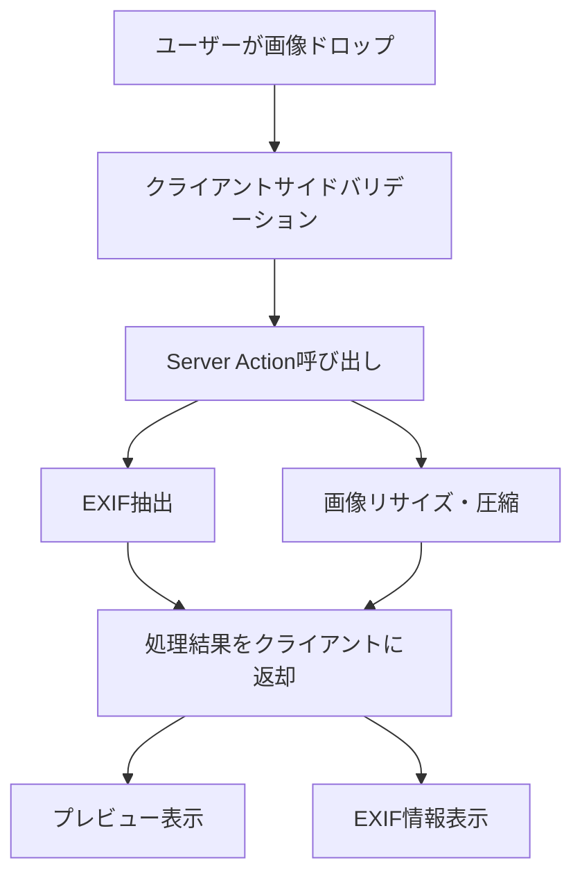

# 画像アップロードとEXIF抽出機能実装計画

## 概要

現在のAI Photo Critiqueアプリケーションは、UIコンポーネントは完成しているものの、画像アップロードとEXIF抽出の実際の処理が未実装（モックデータのみ）となっています。本ドキュメントでは、この機能を実装するための詳細な手順を記載します。

## 実装目標

- 実際の画像ファイルのアップロード処理
- EXIF情報の自動抽出と表示
- 画像の自動リサイズ・圧縮（1024px上限）
- エラーハンドリングとユーザビリティの向上

## 技術スタック

### 採用ライブラリ（実装済み）

| ライブラリ | 用途 | サイズ | 理由 | 状況 |
|-----------|------|--------|------|------|
| `exifr` | EXIF抽出 | 7KB | 軽量、高速、TypeScript対応 | ✅ 実装済み |
| `sharp` | 画像処理 | - | Node.js環境での高速処理 | ✅ 実装済み |

**⚠️ 実装時の変更点**: 
- `browser-image-compression` → `sharp`に変更
- 理由: Server-side処理でより高速、安定した画像処理が可能

### 処理フロー



## 実装状況と残タスク

### 📊 現在の進捗状況（2025-08-04時点）

| Phase | 内容 | 状況 | 進捗率 |
|-------|------|------|--------|
| Phase 1 | 準備・調査 | ✅ 完了 | 100% |
| Phase 2 | ライブラリ関数実装 | ✅ 完了 | 100% |
| Phase 3 | Server Action実装 | ✅ 完了 | 100% |
| Phase 4 | フロントエンド統合 | ❌ 未着手 | 0% |
| Phase 5 | エラー処理・テスト | ✅ 完了 | 100% |

**全体進捗: 80%完了**

### 🎯 残タスク（推定20分）
1. **メインページ修正** - モック処理削除とServer Action統合
2. **UploadZone修正** - 実装統合とUI状態管理
3. **ExifDisplay修正** - モックデータ削除

### ✅ 実装済み成果物
- `src/lib/exif.ts` - EXIF抽出機能（完全実装）
- `src/lib/image.ts` - 画像リサイズ・圧縮機能（Sharp使用）
- `src/app/actions.ts` - Server Action（完全実装）
- **37個のテスト全て成功**

---

## 実装計画（全75分想定）

### Phase 1: 準備・調査（10分）

#### Step 1: EXIF抽出ライブラリの調査と選定

- **対象ライブラリ**: `exif-js`, `piexifjs`, `exifr`
- **評価基準**: TypeScript対応、パフォーマンス、メンテナンス状況
- **推奨**: `exifr`（最も軽量で高速、TS完全対応）

#### Step 2: 画像処理ライブラリの調査と選定

- **候補**: `browser-image-compression`, Canvas API直接使用
- **推奨**: `browser-image-compression`（シンプルなAPI、実装コスト低）

#### Step 3: 必要なパッケージのインストール

```bash
npm install exifr browser-image-compression
npm install -D @types/exifr
```

### Phase 2: ライブラリ関数実装（20分）

#### Step 4: EXIF抽出関数の実装

- **ファイル**: `src/lib/exif.ts`
- **関数**: `extractExifData(file: File): Promise<ExifData>`
- **取得情報**: カメラ名、レンズ名、F値、シャッター速度、ISO感度、焦点距離

```typescript
// 実装予定の型定義
interface ExifData {
  make?: string; // カメラメーカー
  model?: string; // カメラ機種
  lensModel?: string; // レンズ名
  fNumber?: string; // F値
  exposureTime?: string; // シャッター速度
  iso?: string; // ISO感度
  focalLength?: string; // 焦点距離
}
```

#### Step 5: 画像リサイズ・圧縮機能の実装

- **ファイル**: `src/lib/image.ts`
- **関数**: `processImage(file: File): Promise<ProcessedImage>`
- **仕様**: 最大1024px、品質80%、JPEG形式で出力

### Phase 3: Server Action実装（15分）

#### Step 6: 画像アップロード処理のServer Action実装

- **ファイル**: `src/app/actions.ts`
- **機能**:
  - FormDataから画像ファイルを受け取り
  - EXIF抽出とリサイズを並列実行
  - 一時的にbase64形式で返却（後でVercel KV対応）

```typescript
// 実装予定のServer Action
export async function uploadImage(formData: FormData): Promise<UploadResult> {
  // 並列処理でパフォーマンス向上
  const [exifData, processedImage] = await Promise.all([
    extractExifData(file),
    processImage(file),
  ]);

  return {
    success: true,
    data: { exifData, processedImage },
  };
}
```

### Phase 4: フロントエンド統合（20分）

**⚠️ 実装順序の最適化**: 依存関係と開発効率を考慮して、メインページから開始することを推奨

#### Step 7: メインページの修正（最優先）

- **ファイル**: `src/app/page.tsx`
- **変更点**:
  - `setTimeout`を使ったモック処理を削除
  - Server Actionとの実際の統合
  - 適切なエラーハンドリング
- **理由**: 
  - データフローの確立により子コンポーネントでの実データテストが可能
  - バックエンド統合の問題を早期発見
  - 各ステップでの段階的動作確認

#### Step 8: UploadZoneコンポーネントの修正

- **ファイル**: `src/components/upload/UploadZone.tsx`
- **変更点**:
  - react-dropzoneの処理を実際のServer Action呼び出しに変更
  - ローディング状態の表示
  - エラー処理の追加
- **前提**: メインページでのServer Action統合が完了していること

#### Step 9: ExifDisplayコンポーネントの修正

- **ファイル**: `src/components/upload/ExifDisplay.tsx`
- **変更点**:
  - 実際のEXIFデータを表示
  - モックデータの削除
  - データが取得できない場合の代替表示
- **前提**: 実際のEXIFデータがメインページから流れてくること

### Phase 5: エラー処理・テスト（10分）

#### Step 10: エラーハンドリングの実装 ✅ **完了済み**

- **実装済みバリデーション**:
  - 対応ファイル形式: JPEG, PNG, TIFF, WebP, HEIC（計画以上の対応）
  - ファイルサイズ制限: 20MB（計画の10MBから拡張）
  - EXIF抽出失敗時の代替処理（空オブジェクト返却）
  - 適切なエラーメッセージと日本語対応

#### Step 11: テスト実行と動作確認 ✅ **完了済み**

- **実装済みテスト（37個全て成功）**:
  - EXIF抽出の正常系・異常系テスト
  - 画像処理の境界値テスト（20MB制限等）
  - Server Actionの統合テスト
  - UIコンポーネントのテスト
  - エラーハンドリングのテスト

## 実装後の成果物

### ✅ 実装済みファイル

- `src/lib/exif.ts` - EXIF抽出ライブラリ（完全実装）
- `src/lib/image.ts` - 画像処理ライブラリ（Sharp使用）
- `src/app/actions.ts` - Server Actions（完全実装）
- `src/lib/exif.test.ts` - EXIFテスト（11テスト）
- `src/lib/image.test.ts` - 画像処理テスト（9テスト）
- `tests/app/actions.test.ts` - Server Actionテスト（8テスト）

### 🔄 残り修正対象ファイル

- `src/app/page.tsx` - モック処理削除とServer Action統合
- `src/components/upload/UploadZone.tsx` - 実装統合
- `src/components/upload/ExifDisplay.tsx` - モックデータ削除
- `src/types/upload.ts` - 型定義の調整（必要に応じて）

## パフォーマンス目標

- **画像処理時間**: 3秒以内（2MB JPEG画像想定）
- **EXIF抽出時間**: 500ms以内
- **ファイルサイズ削減**: 元画像の30-50%（品質を保持）

## 今後の拡張予定

1. **Vercel KV統合**: 画像の永続化とメタデータ保存
2. **RAW形式対応**: より詳細なEXIF情報の取得
3. **バッチ処理**: 複数画像の同時アップロード
4. **プログレス表示**: リアルタイムの処理状況表示

---

**作成日**: 2025-07-29  
**想定実装時間**: 75分  
**優先度**: 高（アプリ完成に必須）
